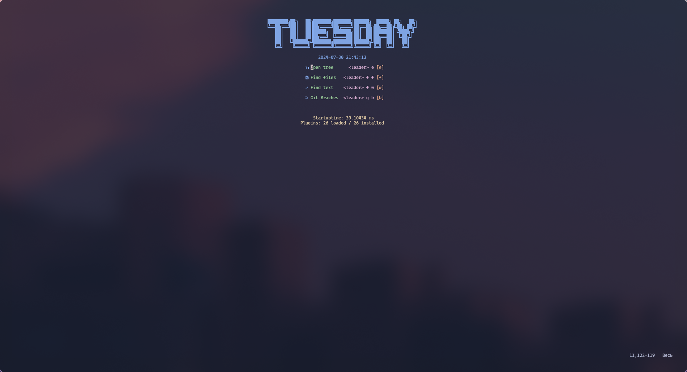
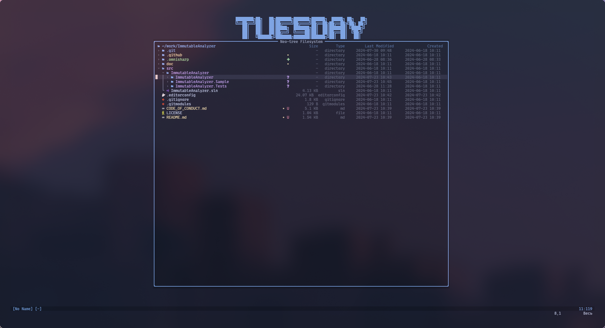
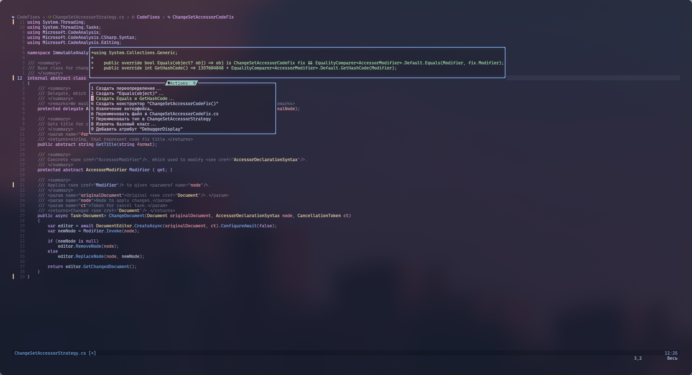
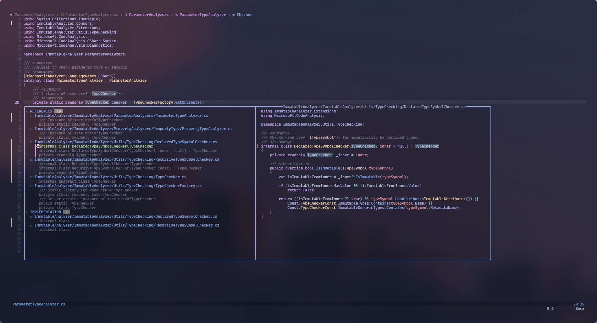
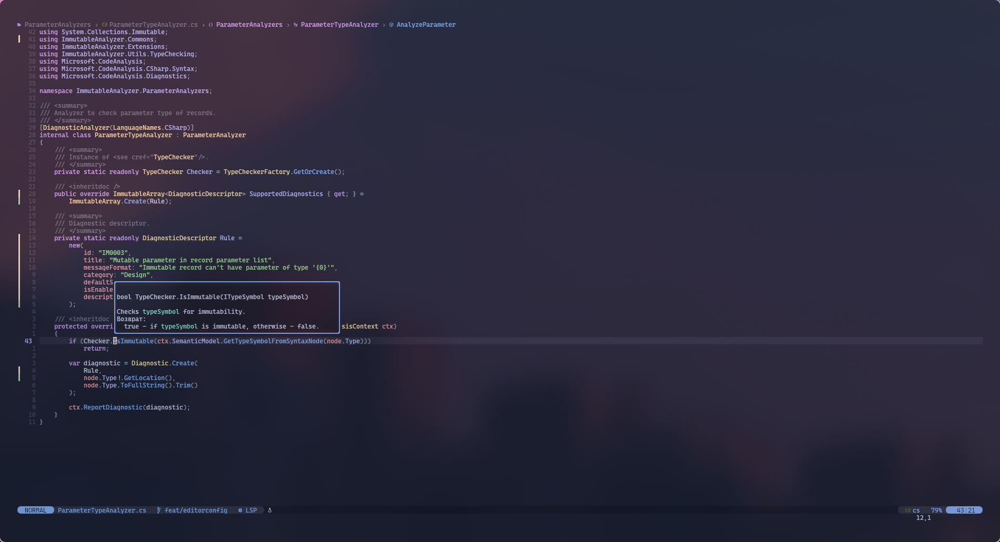
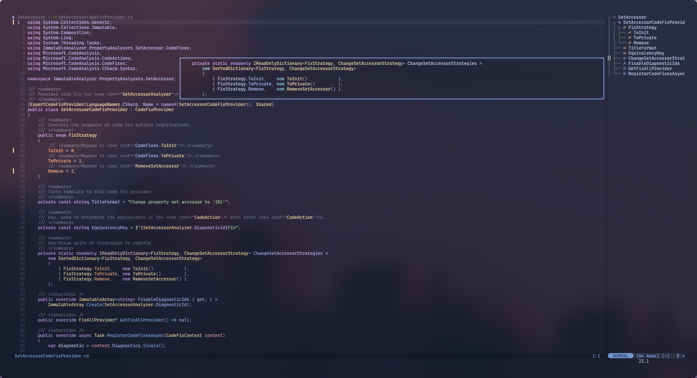
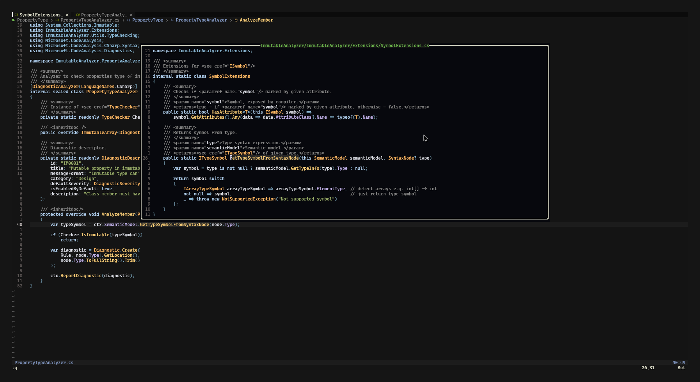

# nvim config



<details>
 <summary>More screenshots</summary>








</details>

My NeoVim configuration for .NET development.

## Structure

Configuration files structured as folder per feature:

```plain
 .
├── init.lua
├── lua
│ ├── core
│ │ └── init.lua
│ ├── features
│ │ ├── init.lua
│ │ ├── language_features
│ │ │ ├── completion
│ │ │ │ ├── config.lua
│ │ │ │ ├── install.lua
│ │ │ │ └── mappings.lua
│ │ │ ├── formating
│ │ │ │ ├── config.lua
│ │ │ │ ├── formatters
│ │ │ │ │ ├── dotnet.lua
│ │ │ │ │ ├── md.lua
│ │ │ │ │ └── stylua.lua
│ │ │ │ ├── install.lua
│ │ │ │ └── mappings.lua
│ │ │ ├── lsp
│ │ │ │ ├── config.lua
│ │ │ │ ├── install.lua
│ │ │ │ ├── langs
│ │ │ │ │ ├── csharp.lua
│ │ │ │ │ └── lua_config.lua
│ │ │ │ └── mappings.lua
│ │ │ └── syntax_highlighting
│ │ │   ├── config.lua
│ │ │   └── install.lua
│ │ └── ui
│ │   ├── colorscheme
│ │   │ ├── config.lua
│ │   │ └── install.lua
│ │   ├── dashboard
│ │   │ ├── config.lua
│ │   │ └── install.lua
│ │   ├── file_tree
│ │   │ ├── config.lua
│ │   │ ├── install.lua
│ │   │ └── mappings.lua
│ │   ├── git
│ │   │ ├── config.lua
│ │   │ └── install.lua
│ │   ├── statusbar
│ │   │ ├── config.lua
│ │   │ └── install.lua
│ │   └── whichkey
│ │    ├── config.lua
│ │    └── install.lua
│ ├── mappings
│ │ └── init.lua
│ ├── plugin_manager
│ │ └── init.lua
└── README.md
```

## Used plugins

catppuccin
cmp-buffer
cmp-cmdline
cmp-nvim-lsp
cmp-path
dashboard-nvim
formatter.nvim
gitsigns.nvim
image.nvim
lazy.nvim
lsp-progress.nvim
lspsaga.nvim
lualine.nvim
mason-lspconfig.nvim
mason.nvim
mini.icons
neo-tree.nvim
nui.nvim
nvim-autopairs
nvim-cmp
nvim-lspconfig
nvim-treesitter
nvim-web-devicons
plenary.nvim
vim-vsnip
which-key.nvim

## Installation

```sh
git clone https://github.com/protomorphine/nvim-config ~/.config/nvim && nvim
```
