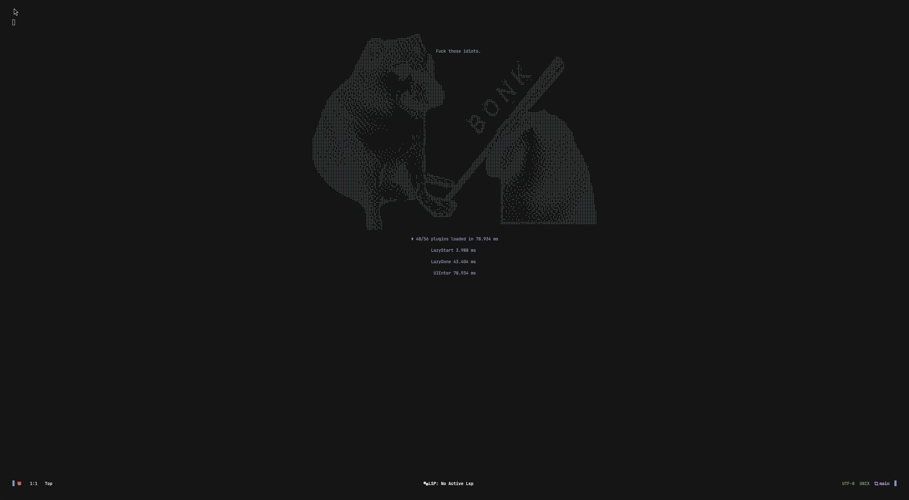

# nvim config



<details>
 <summary>More screenshots</summary>


</details>

My NeoVim configuration for .NET development.

## Installation

```sh
git clone https://github.com/protomorphine/nvim-config ~/.config/nvim && nvim
```
